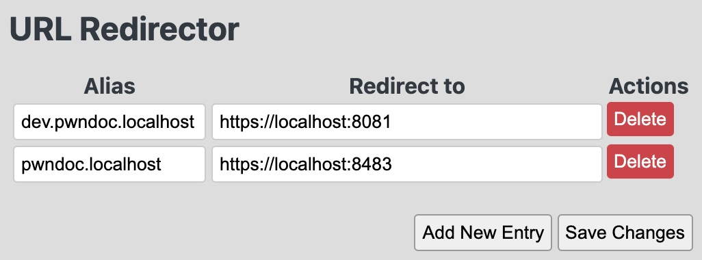

# URL Redirector

A simple extension to redirect urls.

Started as a fork from https://github.com/karan/chrome-url-alias, but I wanted to remove external scripts, so it can be easily inspected for malicious code.
Also fixed some issues of the original project

**NOTE**
You may have issues with your browser, for specific conditions. For example, in brave an url like "test.local" will automatically be redirected to the search engine. So when the extension gets the url, its already the url from the search. To mitigate this you either need to use something like http://test.local, or use a TLD that the browser recognizes, like "test.localhost"

